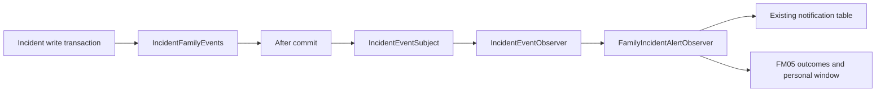

# FM05 incident event / family observer integration

Implemented: the event contract, Observer subject and interface, after-commit bridge, family observer, safe IN_APP message creation, persistent deduplication/outcomes, and personal response windows. Existing incident routing, old notification generators, notification controllers and the bell are unchanged. Production sources do not yet call this contract; consumer transaction tests are not a CG04 end-to-end acceptance test.

## Producer handoff

Inject `sg.nus.carelink.incident.application.IncidentFamilyEvents`. Inside the **write transaction** that saves/routes the incident, publish the corresponding fact:

```java
// New incident, after its persisted ID and final routed elder are known:
events.raised(eventId, incidentId, elderId, occurredAt);

// Escalation chain exhausted, after UNRESOLVED_ESCALATED is persisted:
events.unresolved(eventId, incidentId, elderId, occurredAt);
```

`eventId` is a UUID owned by the producer; `occurredAt` is an OffsetDateTime of the original fact. Keep both stable on replay. No caller identity, family ID, notification text or clinical description is accepted. The bridge normalizes offsets and microsecond precision; reusing an ID with different facts is rejected by the consumer. Calls outside a write transaction fail immediately. Ordinary manager handovers are not family broadcast events.

The publisher registers a callback and dispatches only after successful commit. The subject targets `IncidentEventObserver`, not a particular notifier. Runtime failure in one observer does not block another or turn the already committed source into a failed save. The family consumer uses independent transactions; each recipient rechecks current binding, enabled account and FAMILY role before a new delivery. FULL and READ_ONLY qualify. Optional subscriptions do not disable urgent alerts.



The original routing author must call this contract at the raised/chain-exhausted positions **and remove only the corresponding old direct family notification generation in the same integration**. Preserve manager/caregiver messages and existing inbox/bell functionality. Do not activate both family generators. CG04's HTTP report creation remains its owner's responsibility; FM05 does not call that HTTP endpoint. Bell navigation to `/api/family/incidents/{id}`'s family page remains a separate owner handoff.

## Persistence and failure semantics

Flyway `V14__family_alert_delivery.sql` adds three FM05 tables without modifying existing tables or historical rows:

| Table | Meaning |
| --- | --- |
| `family_alert_event` | Stable event facts and the last processing outcome: PROCESSED, NO_RECIPIENTS or FAILED |
| `family_alert_delivery` | One IN_APP result per event/family, including skipped or failed recipients and safe reason codes |
| `family_alert_window` | First successfully created message and immutable openedAt/acknowledgeBy per incident/family |

Recipient delivery serializes on the event/family unique key using a locking current read. The message, successful delivery row and first window commit together. A failure rolls them back; a separate transaction records FAILED, while other recipients continue. Successful recipients are never recreated on replay; failed or skipped recipients can be re-evaluated when the producer explicitly replays the same event. The outcome tables store IDs, times and fixed reason codes, not descriptions or acknowledgement notes. If outcome storage itself is unavailable, the remaining evidence is a safe log with event ID, family ID and exception type; it cannot be reported as a durable failure record.

Messages use the existing uppercase `INCIDENT`, `IN_APP` and `PENDING` values. The existing inbox transitions them to SENT; SENT means available in the inbox, not read or acknowledged. Titles/bodies use only severity/category or a generic chain-exhausted explanation, never raw description, location, internal logs or staff IDs. The severity/category are read from the persisted incident at consumption time.

The first successful creation opens the default two-hour personal window; `carelink.family-alert.response-window` can override the positive ISO duration (for example `PT45M`). The start is creation time, not event occurredAt, inbox polling time or manager respondBy. Another event, inbox delivery, replay or notification read does not reset it. `GET /api/family/incidents/{id}` returns this current family's deadline, or null if no FM05 window exists. Historical notifications are not backfilled into windows.

Creating a message/window never inserts or alters `incident_acknowledgement`. Existing viewedAt, acknowledgedAt and responseNote remain intact, including acknowledgement before message creation. Future reminder logic must additionally require an absent acknowledgedAt; the existence of a window does not put an already acknowledged family back into waiting. Reminders and family transfer are not implemented here.

This is an in-process after-commit design, without an outbox or a persistent event dispatcher. Outcome/deduplication persistence does not guarantee recovery from a process crash between source commit and callback processing. Keep production activation pending the producer/old-family-sender handoff.


## Existing inbox compatibility and owner handoff

`FamilyIncidentInboxIT` exercises committed FM05 observer output through the existing notification HTTP endpoints, using real login sessions, CSRF and MySQL. It verifies recipient isolation, safe fields and Singapore timestamps, PENDING-to-SENT delivery, authorization filtering before pagination/counts, createdAt/id ordering, SENT/READ filters, READ_ONLY access, revoked/rejected/pending/deleted/expired bindings, missing incidents, empty inbox, staff compatibility and concurrent first-read persistence. Inbox delivery/read/read-all do not create or alter incident view/acknowledgement receipts or the personal window; incident view/acknowledgement do not mark a notification read.

**Compatibility checks do not establish full inbox authorization acceptance.** The following existing-component gaps are reproduced by tests tagged `known-inbox-gap`. These are characterization assertions of current behavior, not approval of that behavior; a green suite does not mean these requirements are met. The notification owner should change the implementation and replace the corresponding characterization assertions with rejection/exclusion assertions when integrating the fix. FM05 does not modify that owner's code or add an adapter that bypasses the rules.

| Reference | Reproduction / actual result | Required behavior / scope |
| --- | --- | --- |
| INBOX-01 | Log in as FAMILY, then disable the account or remove its FAMILY role in the database. The existing session can still list/count/read/read-all its incident notifications. FM05 family detail correctly returns 403 for the same session. | Resolve current account enablement and applicable roles on every care-content operation. This is a production authorization acceptance blocker. Check multi-role sessions as well when the owner fixes it. |
| INBOX-02 | A notification with unknown `resource_type=UNKNOWN_CARE` and an unresolvable resource ID appears with elderId=null and can be marked read. Known INCIDENT rows with a missing incident are correctly excluded. | Explicitly recognize legitimate account-only messages; an unknown care resource must not gain account-message access by default. This is an unresolved scope-filter acceptance blocker. FM05 itself writes only known INCIDENT resources. |
| INBOX-03 | With an injected UTC Clock at 08:00Z and a binding that expires at 16:00 Singapore, the inbox still displays the notice and reports sentAt=08:00+08:00; family detail denies the expired binding. | Use Singapore business time for expiry and displayed timestamps regardless of Clock zone. The current production Clock already uses Asia/Singapore, so this is a portability/test-clock gap, not evidence that default production timestamps are wrong. |

The shared Page/Size schemas specify nonnegative page and size 1–200. The existing service normalizes page=-1 to 0, size=0 to 1 and size=201 to 200. Compatibility tests record this existing clamping policy; no frontend should rely on sending invalid values. Changing that policy is the notification owner's decision, not an FM05 implementation change.

Notification source activation, old family generator handoff and bell navigation remain pending as described above. Successful consumer/inbox tests do not replace real CG04 source acceptance. The family detail frontend can proceed independently while the inbox owner resolves INBOX-01/02.
